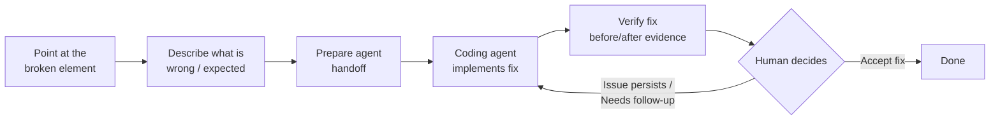

# Viskod

> **AI can read your code. Viskod lets it see your UI.**

Viskod is a **visual context engine** for AI coding agents, built for
frontend and product engineers who use MCP-compatible coding agents (Claude
Code, OpenCode, Cursor, ...).

Coding agents understand source code extremely well. What they cannot
reliably understand is the **running user interface** — which is why fixing
visual bugs usually starts with a prompt like:

> "The third button inside the card on the left doesn't align correctly."

Viskod removes that ambiguity. Point at an element in your running
application and Viskod captures structured visual context — screenshots,
DOM metadata, computed styles, diagnostics and best-effort source hints —
then exposes it through **Model Context Protocol (MCP)** so your coding
agent can reason about what you are actually seeing.

---

# The Workflow: UI Issue → Agent Handoff → Verified Fix



1. **Point at the problem.** In Studio, click `Report UI issue` and click the
   broken element in your app. You never write a CSS selector by hand.
2. **Describe it.** Fill in `What is wrong?` and `What should happen?`.
3. **Prepare agent handoff.** Studio shows `Handoff ready` with a copyable
   prompt for your coding agent.
4. **Verify the fix.** After the agent changes the code, click `Verify fix`,
   review the before/after evidence, and choose `Accept fix`, `Issue
   persists`, or `Needs follow-up`.

> A changed screenshot is **evidence, not truth**. Viskod never auto-accepts
> a fix based on pixels alone — the human decides.

---

# What Viskod Is

* A visual context engine
* A browser inspection system
* An MCP server
* A local-first developer tool
* A bridge between running applications and AI coding agents

# What Viskod Is Not

Viskod is **not**:

* an IDE
* a code editor
* a chatbot
* an AI coding assistant
* a browser replacement
* a Figma alternative
* an autonomous software engineer

Viskod observes and supplies context. External coding agents implement.

---

# Supported Technologies

* **Node.js 22+** (runtime requirement)
* **Chromium** via Playwright (installed automatically, see below)
* **React, Next.js, Vite** applications
* **MCP-compatible coding agents** — Claude Code, OpenCode, and Cursor have
  documented configuration examples; any MCP client can use the server

---

# Installation

## Published package (recommended)

```bash
npm i -g @viskod/cli        # → puts `viskod` on your PATH
```

Also available with:

```bash
bun add -g @viskod/cli
npx @viskod/cli serve       # one-shot, no install
```

Package installation runs `playwright install chromium`, so the first install
downloads a browser. If you already manage Chromium yourself you can opt out
with `PLAYWRIGHT_SKIP_BROWSER_DOWNLOAD=1` — but then you must install
Chromium separately or `viskod` will not be able to launch a browser.

## From source (development)

```bash
pnpm install
pnpm exec playwright install chromium
```

Run a local app — the repository includes a fixture:

```bash
node examples/phase12-source-hint-app/server.cjs
```

Start Studio:

```bash
pnpm exec tsx apps/studio/src/index.ts
```

---

# Studio Quickstart

The recommended Viskod workflow runs through **Studio**:

1. Start your local app (or the included fixture above). Leave it running.
2. Start Studio — it serves its UI on `http://localhost:3001`.
3. Open `http://localhost:3001`, enter your app URL, and click `Open app`.
4. Click `Report UI issue`, hover over the problem, and click it.
5. Describe the problem, click `Prepare agent handoff`, and copy the prompt
   for your coding agent.
6. After the agent changes the code, click `Verify fix` — Studio reloads the
   page (cache-busted) and recaptures the same element so you can compare
   before/after evidence and decide.

Full walkthrough: [QUICKSTART_MCP.md](QUICKSTART_MCP.md)

---

# MCP Quickstart

The MCP server speaks JSON-RPC over stdin/stdout and is started by your MCP
client. The target app must already be listening, or `viskod serve` exits at
startup with a connection error:

```bash
viskod serve --url http://localhost:3000
```

## Claude Desktop

Add to your `claude_desktop_config.json`:

```json
{
  "mcpServers": {
    "viskod": {
      "command": "viskod",
      "args": ["serve", "--url", "http://localhost:3000"]
    }
  }
}
```

## Cursor

Add `.cursor/mcp.json` in your project root with the same `mcpServers`
structure (see [examples/mcp-configs/](examples/mcp-configs/)).

## OpenCode

Add to `~/.config/opencode/opencode.json` or a project-level
`opencode.json`:

```json
{
  "$schema": "https://opencode.ai/config.json",
  "mcp": {
    "viskod": {
      "type": "local",
      "command": ["viskod", "serve", "--url", "http://localhost:3000"],
      "enabled": true
    }
  }
}
```

Ready-made files for all three clients live in
[examples/mcp-configs/](examples/mcp-configs/).

## What the agent can do

`tools/list` exposes `viskod_navigate`, `viskod_select_element`,
`viskod_capture_context`, `create_agent_handoff`, `create_visual_review`,
`recapture_visual_review`, and `get_visual_review`. A capture returns a
structured context packet: DOM snapshot, computed styles, screenshot
metadata, hierarchy, evidence sources, and a confidence rating.

Example agent prompt:
[examples/agent-workflows/prompts/fix-visual-issue.md](examples/agent-workflows/prompts/fix-visual-issue.md)

Technical reference: [AGENT_WORKFLOW.md](AGENT_WORKFLOW.md)

---

# Privacy & Security

Viskod is local-first and designed to keep development data on your machine:

* **Telemetry is disabled by default.**
* **Services bind to localhost/127.0.0.1 only** — no cloud accounts, no
  hosted APIs, no credentials required.
* **Sensitive values are redacted** before an agent ever sees them (API keys,
  tokens, emails, credit-card numbers, secrets in URLs).
* By default Viskod does **not** collect `.env` files, cookies, tokens,
  source code, screenshots, DOM data, or repository contents. Capture is
  explicit, on your machine, for the element you point at.

---

# Current Alpha Limitations

Viskod is an **alpha** release. Expect rough edges and change:

* The CLI and MCP tool set are alpha; interfaces may change.
* **Screenshots capture the viewport only** — content outside the current
  viewport is not captured.
* **Network evidence comes from the page context only** — worker or
  extension network activity is not captured.
* In the MCP path, **selection is CSS-selector-dependent**; dynamic class
  names or shadow DOM can complicate selection. (Studio's point-and-click
  flow hides selectors from you.)
* **Source hints are best-effort** — every hint carries a confidence rating
  and reasoning; treat them as leads, not facts.
* Capture requires the browser session that `viskod serve` starts; it cannot
  capture from a detached or external browser.
* The MCP server is launched by your MCP client over stdin/stdout; it is not
  a standalone network service.

---

# Troubleshooting

| Symptom | Likely cause | Fix |
|---------|-------------|-----|
| `viskod serve` exits at startup | Target URL is not listening | Start your app first, then run `viskod serve --url <url>` |
| Studio exits at startup | Port 3001 already in use | Stop the other process on 3001 |
| Browser does not open | Playwright Chromium missing | `pnpm exec playwright install chromium` (or reinstall the CLI) |
| `Open app` fails | Target URL not listening | Start the app first, then open it in Studio |
| Fix verification looks stale | Browser cache | `Verify fix` always reloads with a cache-busting query parameter |

---

# Contributing & License

Viskod's local visual-context workflow is open source under the
[Apache License 2.0](LICENSE). See [TRADEMARKS.md](TRADEMARKS.md) for the
trademark policy. Contributions, issues, and pull requests are welcome.
